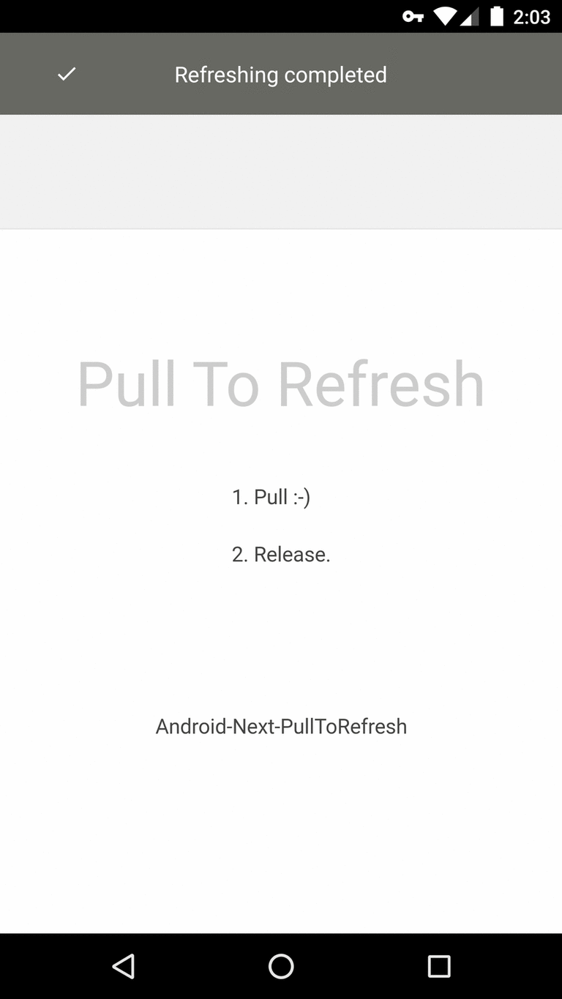

# Android-Next-PullToRefresh
The next version of Android PullToRefresh.


## Screens



## Features
* Supports both Pulling Down from the top, and Pulling Up from the bottom (or even both).
* Animated Scrolling for all devices.
* As it's a container, so its child view theoretically could be any view. Surely working with:
 	* **ListView**
 	* **ExpandableListView**
 	* **GridView**
 	* **WebView**
 	* **ScrollView**
 	* **HorizontalScrollView**
 	* **ViewPager**
* Maven Support.
* Indicators to show the user when a Pull-to-Refresh is available.
* Support for **ListFragment**!
* Lots of customisation options!


## Add dependency
**Gradle dependency:**
``` groovy
compile 'com.sanfriend:ptr:1.0.1'
```

or

**Maven dependency:**
``` xml
<dependency>
	<groupId>com.sanfriend</groupId>
	<artifactId>ptr</artifactId>
	<version>1.0.1</version>
</dependency>
```


## Sample usage
**Layout**
``` xml
<?xml version="1.0" encoding="utf-8"?>
<RelativeLayout xmlns:android="http://schemas.android.com/apk/res/android"
    android:layout_width="match_parent"
    android:layout_height="match_parent">

    <com.sanfriend.ptr.PullToRefreshLayout
        android:id="@+id/ptrLayout"
        android:layout_width="match_parent"
        android:layout_height="match_parent"
        android:background="@color/refreshBackgroundColor"
        app:pull_style="classic"
        app:refresh_trigger_offset="60dp">

        <include
            android:id="@+id/ptr_header"
            layout="@layout/ptr_default_header"/>
	
		<!-- ScrollView, ListView, GridView, WebView,..., any view here -->
        <WebView
            android:id="@+id/ptr_body"
            android:layout_width="match_parent"
            android:layout_height="match_parent" />
    </com.sanfriend.ptr.PullToRefreshLayout>

</RelativeLayout>
```
###### Note
Node id ptr_header, ptr_body, ptr_footer, ptr_header_decoration should be kept as is.


**Activity**
``` java
private PullToRefreshLayout mPtr;
    ...
@Override
protected void onCreate(Bundle savedInstanceState) {
    mPtr = (PullToRefreshLayout)findViewById(R.id.ptrLayout);
    ...
    // set listener
    mPtr.setOnRefreshListener(new OnRefreshListener() {
        @Override
        public void onRefresh() {
            // mWebView.reload();
        }
    });
        
    // tell when to end refreshing
    mWebView.setWebViewClient(new WebViewClient() {
        @Override
        public void onPageFinished(WebView view, String url) {
            super.onPageFinished(view, url);
                
            if (mPtr != null && mPtr.isRefreshing()) mPtr.setRefreshing(false);
        }
    });
    ...
}
```


## Why this
1. Tried [Andriod-PullToRefresh](https://github.com/chrisbanes/Android-PullToRefresh), but it is discontinued and its WebView performs really bad.
2. Tried [SwipeToLoadLayout](https://github.com/Aspsine/SwipeToLoadLayout), no header decoration images.
3. Tried [android-Ultra-Pull-To-Refresh](https://github.com/liaohuqiu/android-Ultra-Pull-To-Refresh), not ideal.
4. Tried ...


## Acknowledgments
1. [SwipeToLoadLayout](https://github.com/Aspsine/SwipeToLoadLayout)
2. [EthanWang](https://github.com/ethanwang)


### License
Licensed under the [Apache License, Version 2.0](http://www.apache.org/licenses/LICENSE-2.0.html)

Copyright (c) 2016 [fotock](https://sanfriend.com/)
